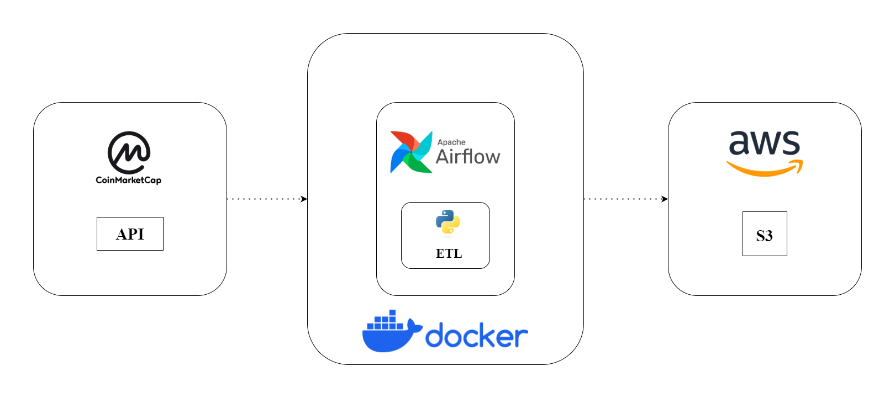
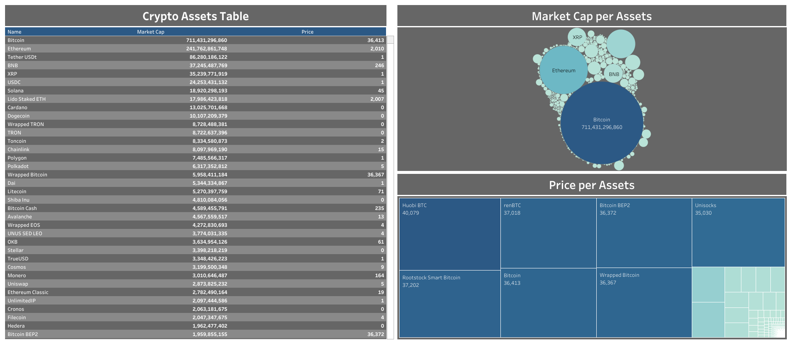

# Crypto Coins Data

&nbsp;&nbsp;&nbsp;&nbsp;&nbsp;&nbsp;Crypto Coins Data is an end-to-end data project that consist of building an ETL pipeline to extract data from CoinMarketCap API periodically (every five minute), then clean the data and save it to csv files, and finally store the files in a data lake in AWS Cloud S3 bucket.

## Tools & Technologies
* Cloud - [AWS Cloud](https://aws.amazon.com/)
* API - [CoinMarketCap API](https://coinmarketcap.com/api/)
* Containerization - [Docker](https://www.docker.com/), [Docker Compose](https://docs.docker.com/compose/)
* Orchestration - [Airflow](https://airflow.apache.org/)
* Data Lake - [AWS S3](https://aws.amazon.com/s3/?nc2=h_ql_prod_st_s3)
* Data Visualization - [Tableau](https://www.tableau.com/)
* Language - [Python](https://www.python.org/)

## Architecture

## Project Steps

### 1. Data Extraction from CoinMarketCap API: 

1. Set Up API Parameters & Headers
   
        parameters = {
            'start':'1',
            'limit':'5000',
            'market_cap_min':'500000',
            'convert':'USD',
            'sort_dir':'desc',
        }
    
        headers = {
            'Accepts': 'application/json',
            'X-CMC_PRO_API_KEY': api_key,
        }

1. Extracting the Data
   
        response = session.get(pro_api_url, params=parameters)
        
        json_data = json.loads(response.text)

### 2. Data Cleansing and Transformation: 

1. Cleansing the data

        raw_df = pd.DataFrame(json_data["data"])
                
        price_lst = []
        
        market_cap_lst = []
        
        for data in raw_df["quote"]:
            
            _data = data["USD"]
            
            price_lst.append(_data["price"])
            
            market_cap_lst.append(_data["market_cap"])
            
        clean_df = pd.DataFrame(columns=['Id','Name','Symbol','Slug','Last Updated','Price','Market Cap'])
        
        clean_df['Id'] = raw_df["id"]
        clean_df['Name'] = raw_df["name"]
        clean_df['Symbol'] = raw_df['symbol']
        clean_df['Slug'] = raw_df['slug']
        clean_df['Last Updated'] = raw_df['last_updated']
        clean_df['Price'] = price_lst
        clean_df['Market Cap'] = market_cap_lst
    
2. Configure CSV file
  
        current_datetime = datetime.now().strftime("%Y-%m-%d_%H-%M-%S")
        
        str_current_datetime = str(current_datetime)   
    
        file_name = "CMC_" + str_current_datetime + ".csv";
        
        file_path = 'cmc/' + file_name

### 3. Data Loading to AWS S3 Data Lake:

1. Set Up the S3 bucket

        s3_bucket = 'my-crypto-data-lake' 
    
        s3_client = boto3.client('s3', aws_access_key_id=access_key, aws_secret_access_key=secret_access_key, region_name='us-east-1');

2. Transform DataFrame to csv file and then send it to AWS S3 Bucket

        with io.StringIO() as csv_buffer:
    
            clean_df.to_csv(csv_buffer, index=False);
            
            response = s3_client.put_object(Bucket=s3_bucket, Key=file_path, Body=csv_buffer.getvalue())
        
        status = response.get("ResponseMetaData", {}).get("HTTPStatusCode");
    
        if status == 200:
            logging.info(f"Succesful S3 response. Status = {status}");
        else:
            logging.info(f"Unuccesful S3 response. Status = {status}");

## Benefits

### 1. Real-Time Data Availability

* By automating data extraction from the CoinMarketCap API, the data lake is continuously updated with the latest cryptocurrency information.

### 2. Cost-Effective Storage and Scalability

* AWS S3 provides cost-effective storage for large volumes of data.

## Data Visualization

